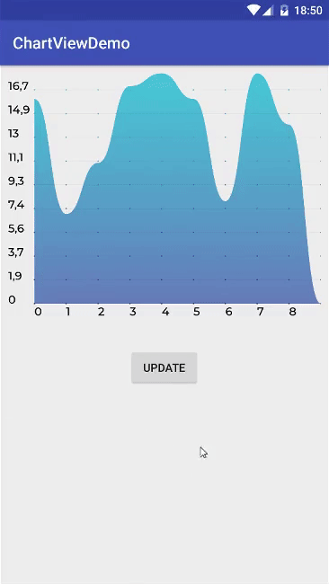

# ChartView
[  ](https://bintray.com/ilyalitosh/Maven/com.ilivan.chartview/_latestVersion)

Introduction
------------
Android UI component for shows charts. <br><br>
ChartView uses Rebound library from Facebook to provide more realistic animation.<br><br>
UI/UX design: [Victoria Kosmovich](https://www.behance.net/vkosmovich)

Demo
----



Get started
-----------

#### Gradle

```gradle
implementation 'com.ilivan.chartview:chartview:1.0.3'
```

#### Maven

```xml
<dependency>
  <groupId>com.ilivan.chartview</groupId>
  <artifactId>chartview</artifactId>
  <version>1.0.3</version>
  <type>pom</type>
</dependency>
```

#### Ivy

```xml
<dependency org='com.ilivan.chartview' name='chartview' rev='1.0.3'>
  <artifact name='chartview' ext='pom' ></artifact>
</dependency>
```

Usage
-----

Create instance of **ChartView**:
```java
ChartView chartView = new ChartView(this);
```
Generate data set for the chart:
```java
ChartDataSet chartDataSet = new ChartDataSet.Builder()
        .add(0, 1.0f)
        .add(1, 2.0f)
        .add(2, 1.5f)
        .add(3, 3.1f)
        .add(4, 1.7f)
        .build();
```
Set the data and draw chart:
```java
// this method will setting data and will drawing chart as well
chartView.setChartDataSet(chartDataSet);
```
##### XML-layout

```xml
<com.ilivan.chartview.ChartView
        android:layout_width="match_parent"
        android:layout_height="250dp"
        android:layout_margin="15dp"
        app:labelsTextSize="13sp"
        app:labelsTextFont="@font/font"
        app:labelsTextColor="@color/text_color"
        app:gridLineWidth="1dp"
        app:gridLineColor="@color/line_color"
        app:gridSize="1.0dp"
        app:gridStartColor="@color/grid_start_color"
        app:gridEndColor="@color/grid_end_color"
        app:chartLineStartColor="@color/chart_line_start_color"
        app:chartLineEndColor="@color/chart_line_end_color"
        app:flexure="0.6"
        android:id="@+id/my_chart"/>
```
`labelsTextSize` - size of labels at the axisY and axisX. <br>
`labelsTextFont` - font of labels at the axisY and axisX. <br>
`labelsTextColor` - color of labels at the axisY and axisX. <br>
`gridLineWidth` - width of the horizontal lines, which located on the grid. <br>
`gridLineColor` - color of the horizontal lines, which located on the grid. <br>
`gridSize` - size of dots, which located on the grid. You may set this value like `0dp`, if you want to hide this dots. <br>
`gridStartColor` - start color for shader of the dots, which located on the grid. <br>
`gridEndColor` - end color for shader of the dots, which located on the grid. <br>
If you don't want to use gradient filling for dots on the grid, you may use the same values for `gridEndColor` and `gridStartColor` parameters. <br>
`chartLineStartColor` - start color of chart line. <br>
`chartLineEndColor` - end color of chart line. <br>
If you don't want to use gradient filling for chart line on the grid, you may use the same values for `chartLineEndColor` and `chartLineStartColor` parameters. <br>
`flexure` - line bending coefficient (use `0..1` values). You may use this value like `0` if you don't need to curve chart line. <br><br>
All this parameters you can set programmatically:
```java
chartView.setChartLineStartColor();
chartView.setChartLineEndColor();
chartView.setGridLineColor();
chartView.setGridLineWidth();
chartView.setGridStartColor();
chartView.setGridEndColor();
chartView.setGridSize();
chartView.setLabelsTextColor();
chartView.setLabelsTextSize();
chartView.setLabelsTextFont();
chartView.setFlexure();
```

Troubleshooting
---------------

If you will see after trying to build project something like this:
```java
Invoke-customs are only supported starting with Android O (--min-api 26)
Message{kind=ERROR, text=Invoke-customs are only supported starting with Android O (--min-api 26), sources=[Unknown source file], tool name=Optional.of(D8)}
``` 
Make sure you use Java 8. It should resolve this issue.

License
-------

ChartView is licensed with the Apache License 2.0. For more details, see [LICENSE](LICENSE).


